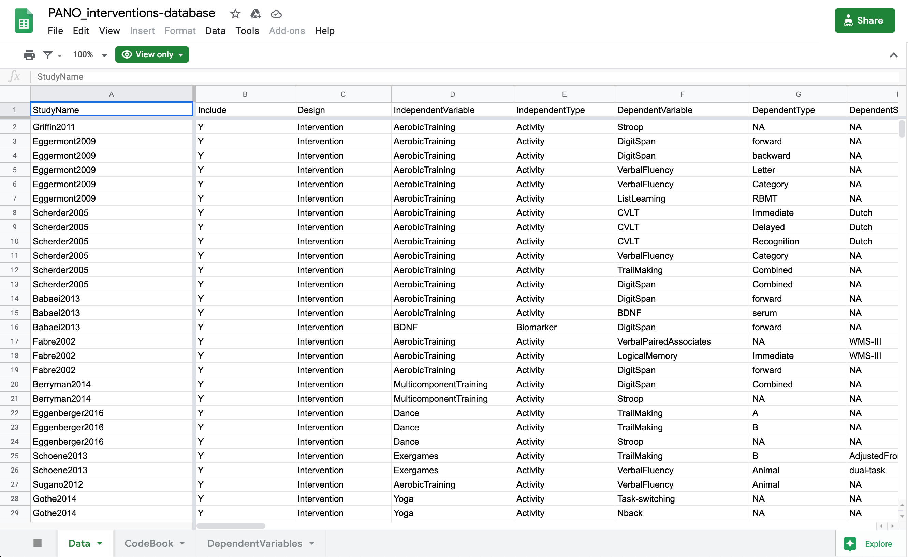
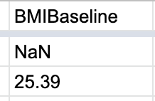
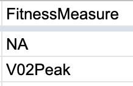
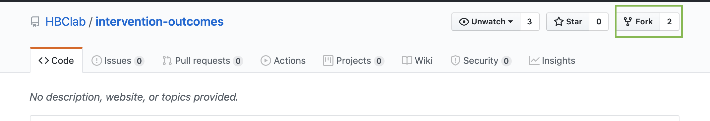
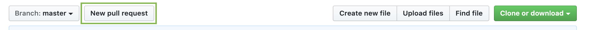

# Contributing to data sources
## Overview
All data in PANO is updated weekly via a continuous integration pipeline. Every sunday night, the most recent copy of the google sheets data source is downloaded and any new entries to the data are run through a validation script to ensure that proper formatting is kept. If the validation passes, the downloaded copy will be pushed to RStudio Shinyapps and the updated data set will be reflected on the main PANO site.
## Adding new data
Any new data to be added to the main plot page of PANO can be directly added to the [google sheet](https://docs.google.com/spreadsheets/d/1nWcS0UrfvnPupAwb4uvaMeY7CqmFqIu09F3I9k4ND3s/edit#gid=0) with appropriate writing permissions.
Data should be added directly to the data tab. It is important to note that when adding a new row to the data sheet, ALL columns must be filled out. If there is no data for a particular column, add the appropriate Nonetype value to the row. 

### Numerical Columns
When adding data to numerical columns, note that all Nonetype values (NA, None, etc.) must be written as `NaN` for validation to pass properly. This is due to the processing that occurs in the R script. 
### Categorical Columns
When adding data to categorical columns, note all Nonetype values must be written as `NA` for the validation to pass properly. It is also important to note that only certain data values are allowed for categorical columns to pass the validation. If any changes are being made to which column values are acceptable for a specific categorical column, they can be modified in the `validation/categorical_key_values.json` file and pushed to github following the best practices outlined below.

# Overview of repo
- `app/` folder contains all files and csv's required to run the web application

# Hosting through RStudio Shinyapps
The PANO application is hosted via [shinyapps](http://shinyapps.io/). All management and analytics regarding usage can be accessed through the associated shinyapps account. Deploying and stopping running instances must also be controlled through the account.

# Best practices regarding development
- All development is encouraged to occur on the dev branch and be merged into the master branch via a pull request

# Contributing walkthrough

## Get the project code on your local machine

### Fork the repository

This will allow you to have your own copy of the project and helps keep the development process modular. For more information on forks, see: https://help.github.com/en/github/getting-started-with-github/fork-a-repo

### Clone the repository
- Open your teminal application and choose a location where you want to store this project
- Using git, clone the repository by typing `git clone https://github.com/YOUR_USERNAME/intervention-outcomes.git`
    - Replace YOUR_USERNAME with your github username in the command above
### Checkout the `dev` branch
- In your terminal, type `cd intervention-outcomes` to enter the project directory
- Next type `git checkout dev`, this will change your copy of the project code to the development branch
    - For more info on branching in git, see: https://guides.github.com/introduction/flow/

## Make/test changes
Edit the code on the `dev` branch as you would like and keep the master branch functional until you have tested/verified that the changes are not "code breaking".

## Commit/push changes
- Commit (make a snapshot) your changes on your local machine by typing `git commit -m "DESCRIPTION_OF_CHANGES"` in your terminal
    - Replace DESCRIPTION_OF_CHANGES with an actual description in the command above
- Push your changes to the remote machine (aka the github website) by typing `git push origin dev` in your terminal

## Merge into master branch and make a pull request
Once the `dev` branch is confirmed to be stable, you can create a pull request on github 
