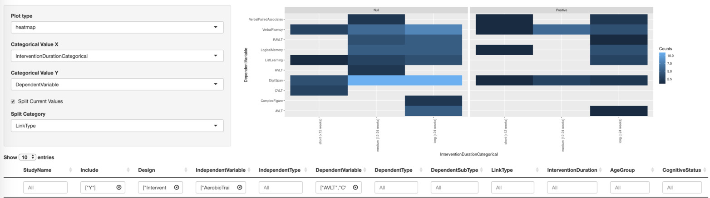

#### **About**

**The Physical Activity Neurocognitive Outcomes (PANO)** application is a tool for visualizing results from intervention studies examining how exercise training affects cognitive outcomes. Currently the intervention database includes results from 100 [individual papers](https://vosslab.shinyapps.io/intervention-outcomes/) that were gathered from the 12 peer-reviewed meta-analyses listed below. Our application aims to provide a tool for visualizing all of these results with user-defined filters to focus on the age-groups, intervention type, covariates, or outcomes of interest.

**Meta-analyses from which individual papers gathered (alphabetical order):**

> 1. Barha, C. K., Davis, J. C., Falck, R. S., Nagamatsu, L. S., & Liu-Ambrose, T. (2017). Sex differences in exercise efficacy to improve cognition: A systematic review and meta-analysis of randomized controlled trials in older humans. Front Neuroendocrinol, 46, 71-85. doi:10.1016/j.yfrne.2017.04.002
> 2. Colcombe, S., & Kramer, A. (2003). Fitness effects on the cognitive function of older adults: a meta-analytic study. Psychol Sci, 14(2), 125-130. 
>3. Falck, R. S., Davis, J. C., Best, J. R., Crockett, R. A., & Liu-Ambrose, T. (2019). Impact of exercise training on physical and cognitive function among older adults: a systematic review and meta-analysis. Neurobiol Aging, 79, 119-130. doi:10.1016/j.neurobiolaging.2019.03.007
>4. Forbes, D., Forbes, S. C., Blake, C. M., Thiessen, E. J., & Forbes, S. (2015). Exercise programs for people with dementia. Cochrane Database Syst Rev(4), CD006489. doi:10.1002/14651858.CD006489.pub4
>5. Heyn, P., Abreu, B., & Ottenbacher, K. (2004). The effects of exercise training on elderly persons with cognitive impairment and dementia: a meta-analysis. Arch Phys Med Rehabil, 85(10), 1694-1704.
>6. Kane, R. L., Butler, M., Fink, H. A., Brasure, M., Davila, H., Desai, P., . . . Barclay, T. (2017). AHRQ Comparative Effectiveness Reviews. In Interventions to Prevent Age-Related Cognitive Decline, Mild Cognitive Impairment, and Clinical Alzheimer's-Type Dementia. Rockville (MD): Agency for Healthcare Research and Quality (US).
>7. Law, L., Barnett, F., Yau, M., & Gray, M. (2014). Effects of combined cognitive and exercise interventions on cognition in older adults with and without cognitive impairment: a systematic review. Ageing Res Rev, 15, 61-75. doi:10.1016/j.arr.2014.02.008
>8. Northey, J. M., Cherbuin, N., Pumpa, K. L., Smee, D. J., & Rattray, B. (2018). Exercise interventions for cognitive function in adults older than 50: a systematic review with meta-analysis. Br J Sports Med, 52(3), 154-160. doi:10.1136/bjsports-2016-096587
>9. Panza, G. A., Taylor, B. A., MacDonald, H. V., Johnson, B. T., Zaleski, A. L., Livingston, J., . . . Pescatello, L. S. (2018). Can Exercise Improve Cognitive Symptoms of Alzheimer's Disease? A Meta-Analysis. J Am Geriatr Soc. doi:10.1111/jgs.15241
>10. Roig, M., Nordbrandt, S., Geertsen, S. S., & Nielsen, J. B. (2013). The effects of cardiovascular exercise on human memory: a review with meta-analysis. Neurosci Biobehav Rev, 37(8), 1645-1666. doi:10.1016/j.neubiorev.2013.06.012
>11. Smith, P. J., Blumenthal, J. A., Hoffman, B. M., Cooper, H., Strauman, T. A., Welsh-Bohmer, K., . . . Sherwood, A. (2010). Aerobic exercise and neurocognitive performance: a meta-analytic review of randomized controlled trials. Psychosom Med, 72(3), 239-252. doi:10.1097/PSY.0b013e3181d14633
>12. Young, J., Angevaren, M., & Rusted…, J. (2015). Aerobic exercise to improve cognitive function in older people without known cognitive impairment. Cochrane Database Syst Rev, 4, CD005381. doi:10.1002/14651858.CD005381.pub4

 

**Why have the PANO application if we can read each meta-analysis?** Published meta-analyses are static and have limited comparability with each other due to differences in inclusion criteria, how effect sizes are computed, and how cognitive tasks are grouped into higher-level cognitive constructs. To address these issues, PANO provides a tool for interactively visualizing results at the task-level across studies with user-defined inclusion criteria upon an updated database of studies. The database can be visualized based simply on number of present studies or based on `LinkType` where outcomes are coded relative to the hypothesized effect (negative/null/positive). With `LinkType`, the app can visualize a conservative estimate of patterns for strong effects, and identify gaps in the literature where few to no studies exist. 

#### **Example usage**

 

**For issues/suggestions, please open an issue on Github [here](https://github.com/zkhan12/intervention-outcomes/issues)**